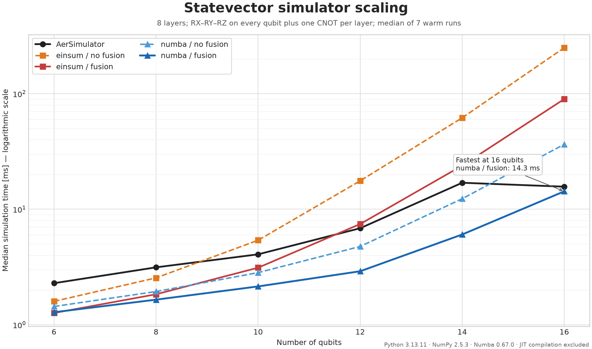

# Quantum Circuit Simulator

[](https://github.com/FinnPedace/Quantum_Circuit_Simulator/actions/workflows/test.yml)
[](https://github.com/FinnPedace/Quantum_Circuit_Simulator/actions/workflows/pre_commit.yml)
[](https://www.python.org/)
[](docs/index.rst)

Der Quantum Circuit Simulator ist eine nachvollziehbare Statevector-Simulation
für Qiskit-Circuits. Das Projekt unterstützt allgemeine Ein-Qubit-Unitaries,
CNOT-Gates, vollständige Endmessungen und Gate Fusion. Zwei numerische Backends
ermöglichen den direkten Vergleich zwischen NumPy-`einsum` und
Numba-kompilierten Blockschleifen.

## Funktionen

- Statevector-Simulation in Qiskits Little-Endian-Basisordnung
- allgemeine 2×2-Ein-Qubit-Matrizen und CNOT-Gates
- optionale Fusion aufeinanderfolgender Ein-Qubit-Gates
- NumPy-`einsum`- und Numba-Backend
- reproduzierbares Measurement Sampling über `shots` und `seed`
- Vergleichstests gegen Qiskit Aer
- Visualisierung von Circuit, Zustandswahrscheinlichkeiten und Counts
- reproduzierbare End-to-End-Benchmarks

## Installation

Benötigt wird Python 3.13 oder neuer. Für die Entwicklung wird
[`uv`](https://docs.astral.sh/uv/) empfohlen:

```bash
git clone https://github.com/FinnPedace/Quantum_Circuit_Simulator.git
cd Quantum_Circuit_Simulator
uv sync --group dev
```

Die aktuelle Entwicklungsversion kann alternativ direkt von GitHub installiert
werden:

```bash
pip install git+https://github.com/FinnPedace/Quantum_Circuit_Simulator.git
```

Das Projekt ist derzeit nicht als offizielles PyPI-Paket veröffentlicht.

## Schnellstart

```python
from qiskit import QuantumCircuit
from quantum_circuit_simulator import SimulationConfig, simulate

circuit = QuantumCircuit(2)
circuit.h(0)
circuit.cx(0, 1)
circuit.measure_all()

result = simulate(
    circuit,
    SimulationConfig(shots=1_000, seed=42),
)

print(result.statevector)
print(result.counts)
```

`statevector` beschreibt den Zustand vor der Endmessung. `counts` enthält die
gesampelten Qiskit-Bitstrings. Die öffentliche `simulate()`-Funktion verwendet
standardmäßig das `einsum`-Backend mit aktivierter Gate Fusion.

Für interne Vergleiche kann der Simulator direkt konfiguriert werden:

```python
from quantum_circuit_simulator.simulator import StatevectorSimulator

simulator = StatevectorSimulator(
    backend="numba",      # "einsum" oder "numba"
    gate_fusion=True,
)
result = simulator.simulate(circuit, SimulationConfig(shots=1_000, seed=42))
```

## Benchmark

Der folgende End-to-End-Benchmark vergleicht Qiskit Aer mit beiden eigenen
Backends, jeweils mit und ohne Gate Fusion. Dargestellt ist der Median aus
sieben warmen Läufen; die Numba-JIT-Kompilierung ist nicht Teil der Messung.
Vor jeder Messung werden alle Statevectoren gegen Aer validiert.



Die absoluten Zeiten hängen von CPU, Betriebssystem und Bibliotheksversionen
ab. Der Plot kann vollständig reproduziert werden:

```bash
uv run python benchmarks/plot_benchmarks.py
```

Ein einzelner Benchmark mit tabellarischer Ausgabe wird so gestartet:

```bash
uv run python benchmarks/benchmark_simulators.py \
    --qubits 14 \
    --layers 8 \
    --repeats 7 \
    --warmups 2
```

Die geplotteten Medianwerte stehen zusätzlich in
[`benchmarks/results/benchmark_simulators.csv`](benchmarks/results/benchmark_simulators.csv).

## Dokumentation

Die vollständige Dokumentation umfasst Installation, Schnellstart,
unterstützte Operationen, Architektur, Gate Fusion, Numba-Backend,
API-Referenz und Benchmarks:

- [Sphinx-Dokumentation](docs/index.rst)
- [Schnellstart](docs/quickstart.rst)
- [API-Referenz](docs/api.rst)
- [Benchmark-Dokumentation](docs/benchmarks.rst)

HTML-Dokumentation erzeugen:

```bash
uv run sphinx-build -W -b html docs docs/_build/html
```

Anschließend kann `docs/_build/html/index.html` im Browser geöffnet werden.

## Tests

```bash
uv run pytest
```

Die Tests vergleichen alle Kombinationen aus `einsum`/Numba und Gate Fusion
an/aus mit Qiskit Aer.

## Einschränkungen

Unterstützt werden Ein-Qubit-Operationen mit einer 2×2-Matrix, `cx`, Barrieren
und vollständige Endmessungen. Andere Mehr-Qubit-Gates, Teilmessungen,
dynamische Circuits, Noise-Modelle und beliebige Initialzustände sind derzeit
nicht implementiert.

## Mitwirkende

Das Projekt wird derzeit entwickelt und gepflegt von:

- Finn Pedace
- Jannis Schuhmacher
